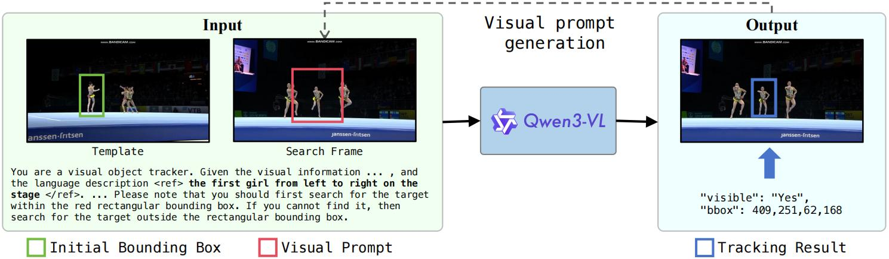
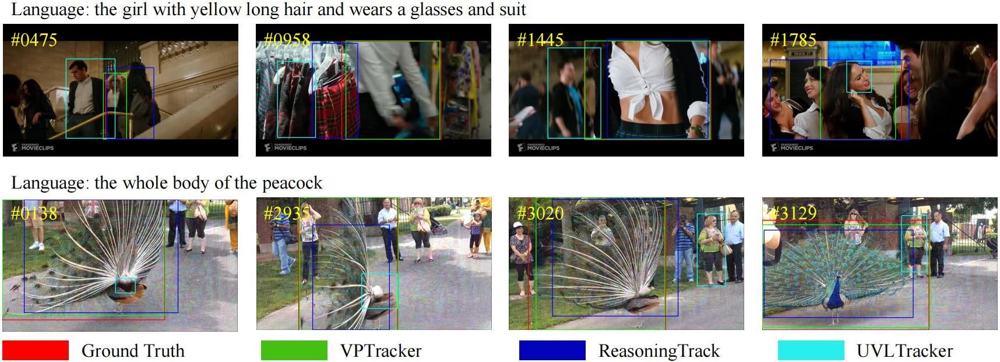

# VPTracker: Global Vision-Language Tracking via Visual Prompt and MLLM

<!-- [](https://huggingface.co/papers/2508.04107) -->
[](https://arxiv.org/abs/2512.22799)
[](https://www.python.org/downloads/)
[](https://pytorch.org/)
[](https://huggingface.co/docs/transformers/)



## 🚀 Quick Start

### Installation

```bash
conda create -n gltrack python==3.10
conda activate gltrack

cd ms-swift
conda install -c conda-forge pyarrow sentencepiece
pip install -e .
pip install "sglang[all]" -U
pip install "vllm>=0.5.1" "transformers<4.55" "trl<0.21" -U
pip install "lmdeploy>=0.5" -U
pip install autoawq -U --no-deps
pip install auto_gptq optimum bitsandbytes "gradio<5.33" -U
pip install git+https://github.com/modelscope/ms-swift.git
pip install timm -U
pip install "deepspeed" -U
pip install flash-attn==2.7.4.post1 --no-build-isolation

conda install av -c conda-forge
pip install qwen_vl_utils qwen_omni_utils decord librosa icecream soundfile -U
pip install liger_kernel nvitop pre-commit math_verify py-spy -U

```

### Data Preparation
Referring segmentation datasets: [TNL2K](https://web.archive.org/web/20220413011718/https://bvisionweb1.cs.unc.edu/licheng/referit/data/refcoco.zip), [TNLLT](https://web.archive.org/web/20220413011656/https://bvisionweb1.cs.unc.edu/licheng/referit/data/refcoco+.zip)

```angular2html
|-- data
│   ├── tnl2k
│   │   ├──test
│   │   |   ├──advSamp_Baseball_game_002-Done
│   │   |   └──...
│   │   └──train
│   │       ├──Arrow_Video_ZZ04_done
│   │       └──...
│   └── tnllt
│       ├──JE_Assian_ship_v01
│       └──...
```
### Data PreParation

```bash
bash data_preparation.sh
```

### Model Training

```bash
bash train.sh
```

### Model Testing

```bash
bash infer.sh
```

## 📦 Checkpoints

You can download it from HuggingFace:
[VPTracker](https://huggingface.co/jcwang0602/VPTracker)


## 👀 Visualization



## 🙏 Acknowledgments
This code is developed on the top of [ms-swift](https://github.com/modelscope/ms-swift)

## ✉️ Contact

Email: jcwang@stu.ecnu.edu.cn. Any kind discussions are welcomed!

---

## 📖 Citation
If our work is useful for your research, please consider cite:
```
@misc{wang2025vptrackerglobalvisionlanguagetracking,
      title={VPTracker: Global Vision-Language Tracking via Visual Prompt and MLLM}, 
      author={Jingchao Wang and Kaiwen Zhou and Zhijian Wu and Kunhua Ji and Dingjiang Huang and Yefeng Zheng},
      year={2025},
      eprint={2512.22799},
      archivePrefix={arXiv},
      primaryClass={cs.CV},
      url={https://arxiv.org/abs/2512.22799}, 
}
```
<!-- ## ✨ Star History
[](https://star-history.com/#jcwang0602/MLLMSeg&Date) -->
