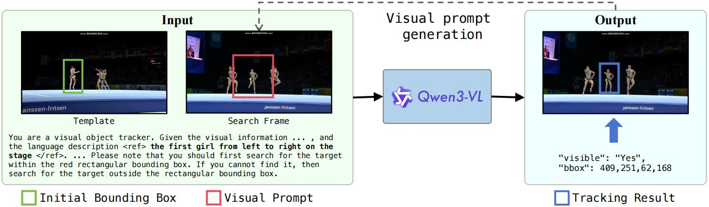

# VPTracker: Global Vision-Language Tracking via Visual Prompt and MLLM

[Paper](https://arxiv.org/abs/2512.22799) · [Model weights](https://huggingface.co/jcwang0602/VPTracker)

VPTracker tracks an object from its initial bounding box and language description.
This repository contains the dataset builder, supervised fine-tuning code, and
frame-by-frame inference for the Qwen3.5-2B version.



## Install

Use Python 3.10 or newer and a PyTorch installation suitable for your CUDA driver.

```bash
git clone https://github.com/jcwang0602/VPTracker.git
cd VPTracker
python -m venv .venv
source .venv/bin/activate
python -m pip install -r requirements.txt
```

For training, also install:

```bash
python -m pip install -r requirements-train.txt
```

The training requirements install the included `ms-swift/` source in editable
mode. This source is based on official ms-swift v4.5.3 and retains the SFT and
inference components; its local version is `4.5.3+vptracker1`. See
[ms-swift/README.md](ms-swift/README.md) for the upstream revision and changes.

`train.sh` runs this repository's source and loads
`ms-swift/swift/template/vptracker_plugin.py`, which crops the template and draws
the visual prompt before tokenization. Tracking inference uses Transformers
directly. Both paths share the prompt and image preparation code in `vptracker/`.

## Build the training dataset

Download [TNL2K](https://github.com/wangxiao5791509/TNL2K_evaluation_toolkit) and
[TNLLT](https://github.com/Event-AHU/Open_VLTrack) from their providers. Arrange the
extracted sequences as follows; each sequence needs `imgs/`, `groundtruth.txt`
with one `x,y,width,height` row per frame, and `language.txt`.

```text
data/                            # Raw datasets
├── tnl2k/
│   └── train/
│       └── <sequence>/{imgs/,groundtruth.txt,language.txt}
└── tnllt/
    └── <sequence>/{imgs/,groundtruth.txt,language.txt}
data_jsonlines/                   # Generated training JSONL
models/                          # Downloaded base models or tracking weights
outputs/                         # Training runs and saved models
results/                         # Tracking predictions
```

These local directories are ignored by Git; datasets, weights, and generated
results are not included in the code repository. The tracked
`data_specs/tnllt_train_split.txt` contains the TNLLT training sequence names used
by the builder.

```bash
bash data_preparation.sh \
    --tnl2k-root data/tnl2k \
    --tnllt-root data/tnllt \
    --output data_jsonlines/train.jsonl
```

The defaults generate 1,000,000 samples with seed 42: 700,000 from TNL2K's
`train/` directory and 300,000 from the TNLLT training sequences listed in
`data_specs/tnllt_train_split.txt`. Use `--samples 100` for a small build.
This reduces the number of generated pairs; the selected training sequences must
still be available in both dataset roots. The builder checks frame/annotation
counts and fails on incomplete sequences.

Each JSONL row contains a visible template frame, a later search frame, a tracking
instruction, an answer with visibility and an absolute-pixel `xyxy` box, and
`visual_prompt` metadata. Images remain on disk; keep them accessible at the
absolute paths recorded in the JSONL. Training crops the template at scale 2,
draws a solid blue one-pixel prompt on the full search image with a scale sampled
from 2 through 8, and uses a 0.75 probability for the contained-prompt branch.

## Train

```bash
GPUS=1 bash train.sh
```

By default, training reads `data_jsonlines/train.jsonl` and saves each run under
`outputs/VPTracker/` in a versioned subdirectory. Run the dataset builder first.

The default base is `Qwen/Qwen3.5-2B`. The script performs full-parameter SFT for
one epoch with learning rate `2e-5`, BF16, and effective batch size 128. SDPA is the
default attention backend. Training requires CUDA hardware with BF16 support;
memory needs depend on image size and per-device batch size.

For multiple GPUs or a local model/dataset:

```bash
GPUS=8 MODEL=/path/to/Qwen3.5-2B DATASET=/path/to/train.jsonl \
    OUTPUT_DIR=outputs/VPTracker bash train.sh
```

`PER_DEVICE_BATCH_SIZE` defaults to 4. Reduce it if GPU memory is limited; gradient
accumulation is computed from `BATCH_SIZE / (GPUS * PER_DEVICE_BATCH_SIZE)`.
Additional ms-swift SFT arguments can be appended to `train.sh`. Model processor
defaults determine image resolution, with no extra image-token cap applied.

## Run tracking

Provide a directory of video frames, a target description, and the target's
initial box in **`x y width height` pixel coordinates**:

```bash
bash infer.sh \
    --model jcwang0602/VPTracker \
    --frames /path/to/video/imgs \
    --language "the person wearing a red shirt" \
    --init-bbox 120 80 50 100 \
    --output results/video.txt
```

Replace the example paths, description, and box with your video's inputs. The box
must lie inside the first frame. Use `--device cuda:0` to select a GPU.

To use your own trained model, pass the `last_model_checkpoint` path printed at
the end of training to `--model`. With the default output settings, this is a
directory such as `outputs/VPTracker/v0-<timestamp>/checkpoint-<step>/`, containing
the model configuration, processor files, and weights.

Frames are read in natural filename order. The tracker keeps the initial visual
template, draws the blue search prompt around the previous position at scale 3,
and predicts on the full search image. The output contains one comma-separated
`x,y,width,height` row per frame, including the initial box. If the model reports
the target invisible or returns an invalid box, the tracker retains the previous
position and prints a diagnostic. Output is published only after all frames
finish successfully.

## Citation

```bibtex
@misc{wang2025vptrackerglobalvisionlanguagetracking,
  title={VPTracker: Global Vision-Language Tracking via Visual Prompt and MLLM},
  author={Jingchao Wang and Kaiwen Zhou and Zhijian Wu and Kunhua Ji and Dingjiang Huang and Yefeng Zheng},
  year={2025},
  eprint={2512.22799},
  archivePrefix={arXiv},
  primaryClass={cs.CV}
}
```

Built with [ms-swift](https://github.com/modelscope/ms-swift) and
[Transformers](https://github.com/huggingface/transformers). Code is licensed under
Apache-2.0; see [LICENSE](LICENSE).
